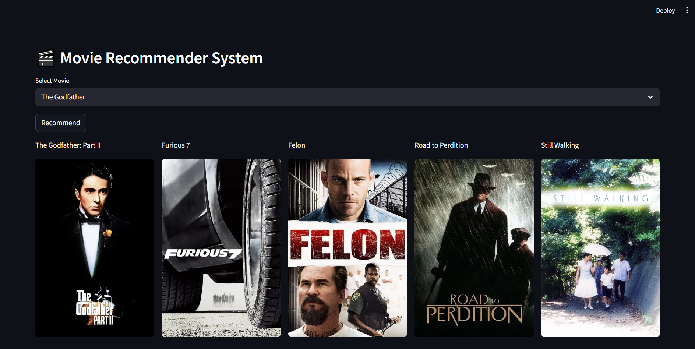

# 🎬 Movie Recommender System

A simple web app built with **Streamlit** that recommends movies based on a selected movie. It fetches movie posters using the **TMDB API** and displays the top 5 similar movies.

---

## Features

- Select a movie from a dropdown list
- Get top 5 recommended movies
- Display movie posters alongside titles
- Uses a precomputed similarity matrix for recommendations
- Built with Python, Streamlit, and TMDB API

---

## Requirements

- Python 3.7+
- Streamlit
- Requests
- Pandas
- Numpy
- TMDB API Key

---

## Demo



---

### Step 1: Get a TMDB API Key

Visit and log in:  
[https://www.themoviedb.org/](https://www.themoviedb.org/)  

After login, generate your API key and keep it handy for Step 4.

---

## Step 2: Clone the Repository

Open your terminal or command prompt and run:

```bash
git clone https://github.com/aakashstha1/movie_recommender.git
cd movie_recommender
```

---

## Step 3: Create a Virtual Environment (Optional but Recommended):

```bash
python -m venv venv
venv\Scripts\activate   #For Windows
source venv/bin/activate    #For Mac/Linux
```

---

## Step 4: Install Dependencies

``bash
pip install -r requirements.txt
```

---

## Step 5: Create a .env File

Create a file named .env in your project folder (same folder as app.py) and add your TMDB API key:

```bash
TMDB_API_KEY=your_api_key_here
```

---

## Step 6: Run the App

```bash
streamlit run app.py
```